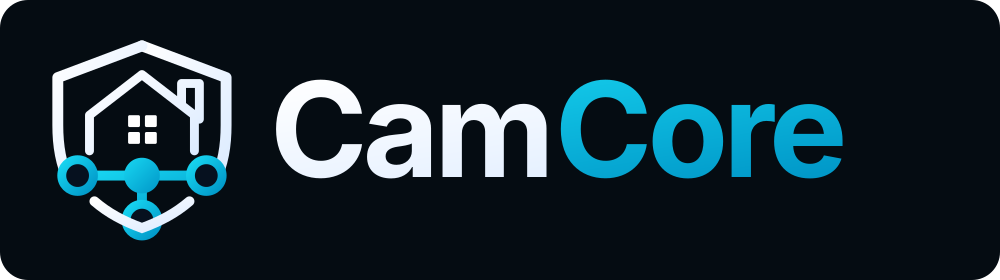

> [!NOTE]
> **Fork provenance.** This repository is retained under the CamCore GitHub account as a fork of [007revad/Transcode_for_x25](https://github.com/007revad/Transcode_for_x25). The current default branch contains no CamCore-specific implementation. Its presence does not indicate an active CamCore deployment, CamCore operational support or original CamCore authorship. Use the upstream project for product documentation and support. The upstream README continues below unchanged, and the repository's licence text remains unmodified.

<!-- CAMCORE-REPOSITORY-BRANDING:START -->
<p align="center">
  <a href="https://camcore.au">
    
  </a>
</p>
<!-- CAMCORE-REPOSITORY-BRANDING:END -->

#  Transcode for x25

<a href="https://github.com/007revad/Transcode_for_x25/releases"></a>
[](https://github.com/007revad/Transcode_for_x25/releases)

[](https://www.paypal.com/paypalme/007revad)
[](https://github.com/sponsors/007revad)
<!-- [](https://user-badge.committers.top/australia/007revad) -->

### Description

Installs the modules needed for Plex or Jellyfin hardware transcoding in DS425+ and DS225+ that Synology removed to save 20 cents per year.

Version 3 and later is available as a package or a script.

### Update

- Package version 4.1.16 and later no longer needs users to set permissions manually.
- Version 4 also supports DSM 7.4.
- Version 3 added the HDR to SDR tone mapping bug fix.

## Package information

### What the package does

When you start the package it: 
1. Unloads the default i915 drivers.
2. Loads the good i915 drivers.

When you stop the package it: 
1. Unloads the good i915 drivers.
2. Loads the default i915 drivers.

### How to install the package

There are 2 ways to install the package:

**Directly from Package Center**

1. Add [007revad Synology Package Source](https://github.com/007revad/Synology_package_source/blob/main/README.md) to package Center.
2. Click on the Community section in Package Center and install the package.

**Or download the package and install it manually**

1. Download the latest version .spk file from https://github.com/007revad/Transcode_for_x25/releases and save it to your Synology.
2. In Package Center click on Manual Install.
3. Browse to where you downloaded the .spk file.
4. Select the .spk file and click Next.
5. If you haven't installed the Transcode Drivers for x25 package before Package Center will warn that the package failed to install.
    - It actuallly did install but will show Error in Package Center.
6. [Set the permissions that the package needs](https://github.com/007revad/Transcode_for_x25/blob/main/set_package_permissions.md). <-- **IMPORTANT**
7. You can now click Run to start the Transcode Drivers for x25 package.

## Script information

### What the script does

The script automates the steps outlined by Luka Manestar on Blackvoid.club here: [Unlocking plex HW transcoding on X25 Synology models](https://www.blackvoid.club/unlocking-plex-hw-transcoding-on-x25-synology-models/)

1. Checks it is running as root.
2. Checks it is running on a Synology model that needs it (synology_geminilakenk).
3. Checks if there is a newer version of this script available.
4. Creates a **x25_drivers** folder in the same folder as the script (if the folder does not already exist).
5. Downloads **x25_transcode_modules.zip** from blackvoid and saves it in the **x25_drivers folder** (if the zip file does not already exist).
6. Unzips the downloaded zip file (if the script downloaded the zip file).
7. Unloads the default driver modules.
8. Loads the working driver modules.

On subsequent runs steps 4, 5 and 6 would be skipped (because the **x25_drivers** folder and **x25_transcode_modules.zip** file already exist).

### Options when running the script

There are optional flags you can use when running the script:

```
Options:
  -h, --help            Show this help message
  -v, --version         Show the script version
  -r, --restore         Restore default modules
      --autoupdate=AGE  Auto update script (useful when script is scheduled)
                          AGE is how many days old a release must be before
                          auto-updating. AGE must be a number: 0 or greater
```

### Download the script

1. Download the latest version _Source code (zip)_ from https://github.com/007revad/Transcode_for_x25/releases
2. Save the download zip file to a folder on the Synology.
3. Unzip the zip file.

### To run the script via task scheduler

You need to schedule this script to run as root at boot. It needs to run every time the NAS boots up.

See [How to schedule](https://github.com/007revad/Transcode_for_x25/blob/main/how_to_schedule.md)

### To run the script via SSH

Note: If you have scheduled the script to run as root at boot-up you don't need to run the script via SSH.

[How to enable SSH and login to DSM via SSH](https://kb.synology.com/en-global/DSM/tutorial/How_to_login_to_DSM_with_root_permission_via_SSH_Telnet)

```YAML
sudo -s /volume1/scripts/transcode_for_x25.sh
```

**Note:** Replace /volume1/scripts/ with the path to where the script is located.

### Troubleshooting the script

If the script won't run check the following:

1. Make sure you download the zip file and unzipped it to a folder on your Synology (not on your computer).
2. If the path to the script contains any spaces you need to enclose the path/scriptname in double quotes:
   ```YAML
   sudo -s "/volume1/my scripts/transcode_for_x25.sh"
   ```
3. Make sure you unpacked the zip or rar file that you downloaded and are trying to run the transcode_for_x25.sh file.
4. Set the script file as executable:
   ```YAML
   sudo chmod +x "/volume1/scripts/transcode_for_x25.sh"
   ```

### Package Screenshots

<!--- <p align="center">Permissions instructions</p> --->
<!--- <p align="center"></p> --->

<!--- <br> --->

<p align="center">Installing package</p>
<p align="center"></p>

<br>

<p align="center">Package installed</p>
<p align="center"></p>

<br>

<p align="center">Plex HW Transcoding working</p>
<p align="center"></p>

<br>

<p align="center">Open button shows the log</p>
<p align="center"></p>

<br>

<p align="center">Select text, right-click, copy</p>
<p align="center"></p>

### Script Screenshots

<p align="center">Running script via SSH</p>
<p align="center"></p>

<br>

<p align="center">Plex HW Transcoding working</p>
<p align="center"></p>
